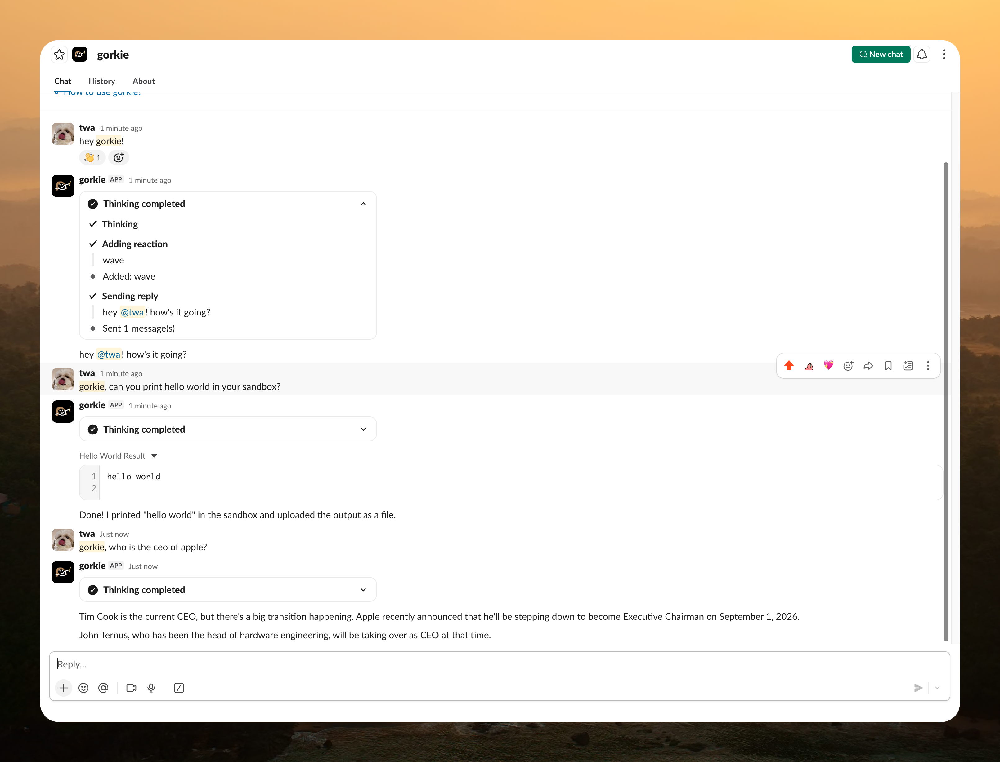

<div align="center">
  
  <h1>gorkie</h1>
  <p>An AI assistant for Slack, built on Mastra.</p>
</div>

## Introduction

gorkie answers mentions, DMs, and subscribed threads, and runs code in a
sandbox to get those answers. It also runs recurring scheduled tasks on its
own.

The bot is a long-lived Bun process. [Mastra][mastra]'s built-in
[channels][channels] feature handles Slack events, wiring the [Vercel Chat
SDK][chat-sdk] Slack adapter in Socket Mode while the agent runs on Mastra's
native runtime. Each Slack thread gets its own [E2B][e2b] sandbox, so gorkie
runs commands and inspects files without touching the host machine.

## Features

- Slack-native replies for mentions, DMs, and subscribed thread follow-ups,
  streamed as they generate, with a typing indicator.
- Optional opt-in allowlist (`OPT_IN_CHANNEL`): gate access to members of one
  channel, with an in-Slack opt-in card for everyone else.
- Per-thread [E2B][e2b] sandbox sessions: isolated cloud VMs, never the host.
  Full filesystem access (`read_file`/`write_file`/`edit_file`/`list_files`/
  `delete_file`/`file_stat`) plus shell command execution
  (`execute_command`) with background process support (`get_process_output`,
  `kill_process`).
- Delegated helper agents for research (Slack and web lookups) and codebase
  exploration (read-only workspace inspection), so multi-step digging stays
  out of the main conversation.
- Web search and page fetching via [Exa][exa], plus a Slack "code mode" tool
  for query-driven or exhaustive conversation analysis.
- Slack-native tools: read/summarize conversation history, list threads and
  channels, inspect channels and users, post to another thread/channel/DM,
  upload and download files, react, leave a thread. It reads only the current
  conversation and public channels, and DMs only the person who asked.
- Slack Canvas tools: create, list, read, edit, and look up sections.
- Recurring scheduled tasks (cron-based, create/list/pause/resume/delete).
  Each run posts back into the conversation where it was scheduled.
- AI image generation, uploaded back into the Slack thread as a file.
- Most tools load on demand through tool search, so the base tool list and the
  prompt stay small.
- [Observational Memory][om] compresses a long conversation into an
  observation log instead of carrying the full raw history.
- Mastra Observability tracing, stored locally in DuckDB.

See [TODO.md](./TODO.md) for open work and known issues.

## Tech stack

- [Bun][bun] and TypeScript
- [Mastra][mastra], agent runtime + [channels][channels]
- [Vercel Chat SDK][chat-sdk] with `@chat-adapter/slack` (via Mastra channels)
- Model routing across the [Hack Club][hackclub] proxy and opencode.ai, which
  falls back per gateway when one fails
- [E2B][e2b] sandbox sessions
- [Exa][exa] for web search and page fetching
- [PostgreSQL][postgres] via `@mastra/pg`
- Mastra Observability, exported to local [DuckDB][duckdb]

## Getting started

Create a new [Slack app](https://api.slack.com/apps) from a manifest using
[`slack-manifest.json`](./slack-manifest.json), which turns on Socket Mode,
the App Home, scopes, and event subscriptions. You also need [Bun][bun], a
[PostgreSQL][postgres] database, an [E2B][e2b] API key, an [Exa][exa] API key,
and a model key ([Hack Club][hackclub] or [OpenCode][opencode], or both).

```bash
# Clone this repository
git clone https://github.com/techwithanirudh/gorkie.git

# Install dependencies
bun install

# Copy and fill in the environment
cp .env.example .env

# Build the configured E2B sandbox image
bun run build:template

# Run the bot locally (also serves Mastra Studio at http://localhost:4111)
bun run dev
```

Local development uses Slack Socket Mode, so the bot needs no public HTTP
tunnel to receive Slack events. It logs `[gorkie] online` once connected.

Do not run two local instances against the same Slack app token. Their Socket
Mode connections race, and the resulting behavior is hard to diagnose.

For a production-style run: `bun run build` then `bun run start`.

### Local Postgres database

The default `DATABASE_URL` in [`.env.example`](./.env.example) points at a
local database named `gorkie`. Mastra creates its tables on first run.

## Environment

| Variable | Required | Description |
|---|---|---|
| `SLACK_BOT_TOKEN` | yes | Bot User OAuth token (`xoxb-…`) |
| `SLACK_APP_TOKEN` | yes | App-level token with `connections:write` (`xapp-…`) |
| `OPT_IN_CHANNEL` | no | Slack channel id gating access to members only (opt-in allowlist); unset means everyone is allowed |
| `HACKCLUB_API_KEY` | yes | Hack Club AI proxy key, tried for every model |
| `OPENCODE_API_KEY` | yes | opencode.ai/zen gateway key, tried alongside Hack Club |
| `DATABASE_URL` | yes | Postgres connection string |
| `E2B_API_KEY` | yes | E2B sandbox key (`e2b_…`) |
| `CREDENTIALS_KEY` | yes | Encrypts connected GitHub and MCP tokens at rest (`openssl rand -base64 32`) |
| `GITHUB_APP_SLUG` | yes | The app's URL slug, used to link people to the install page |
| `GITHUB_APP_CLIENT_ID` | yes | GitHub App client id, for the App Home sign-in (see [docs/github-app.md](./docs/github-app.md)) |
| `GITHUB_APP_CLIENT_SECRET` | yes | GitHub App client secret, used to refresh expiring user tokens |
| `EXA_API_KEY` | yes | Exa key, powers `search_web`/`fetch_url` |
| `AGENTMAIL_API_KEY` | no | Lets the sandbox reach the AgentMail API as `gorkie@agentmail.to`, without the key entering the sandbox |

See [`.env.example`](./.env.example) for the full annotated list.

## Project structure

```text
src/
  env.ts                        Zod-validated environment
  mastra/
    index.ts                    Mastra instance: Postgres, Observability, logger, agents
    config.ts                   Sandbox and agent config
    providers.ts                Model gateway definitions (orchestrator, summarizer, scout, explorer, images)
    agents/orchestrator.ts      The agent: model, instructions, memory, tools, channels
    agents/research.ts          Delegated Slack/web research helper agent
    agents/explore.ts           Delegated read-only codebase exploration helper agent
    chat/                       Chat SDK client, handlers, typing status
    workspace/                  E2B sandbox workspace (per-thread, isolated)
    tools/                      Tool registry: Slack, canvas, scheduled tasks, sandbox, web, code mode
    processors/                 Input/output processors (delegated tools, sandbox, tool media)
    prompts/                    System prompt sections (core, personality, Slack, tools)
    mcp/                        MCPClient scaffold for connecting external MCP servers
```

Constructing the Mastra instance registers the agent, which opens the Slack
Socket Mode connection.

## Development

```bash
bun run dev             # Mastra Studio and the Slack bot
bun run build           # Production build
bun run start           # Run the production build
bun run build:template  # Build the configured E2B image
bun run typecheck
bun run check           # Biome/ultracite
bun run check:spelling
```

## License

[AGPL-3.0](./LICENSE)

[mastra]: https://mastra.ai
[channels]: https://mastra.ai/docs/channels/overview
[chat-sdk]: https://github.com/vercel/chat-sdk
[e2b]: https://e2b.dev
[exa]: https://exa.ai
[hackclub]: https://ai.hackclub.com
[opencode]: https://opencode.ai/docs/zen
[postgres]: https://www.postgresql.org
[duckdb]: https://duckdb.org
[bun]: https://bun.sh
[om]: https://mastra.ai/docs/memory/observational-memory
