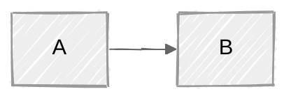

# Mermaid Diagramming

Slack does not render Mermaid code blocks, so a diagram only reaches the user as an image. Write the source to a `.mmd` file in the sandbox, render it, look at it, and upload it.

mermaid-cli is not preinstalled. Point it at the Chromium already in the sandbox so `npx` does not download its own:

```bash
export PUPPETEER_SKIP_DOWNLOAD=1
export PUPPETEER_EXECUTABLE_PATH="$(python3 -c 'from cloakbrowser.download import ensure_binary; print(ensure_binary())')"
npx -y @mermaid-js/mermaid-cli -i diagram.mmd -o diagram.png -s 2 -b white
```

If Chromium refuses to start with a sandbox error, write `{"args": ["--no-sandbox"]}` to `puppeteer.json` and add `-p puppeteer.json`.

Check the PNG with `view_image`, then send it with `upload_file`. If rendering fails, read the parse error, fix the source, and render again. If it still fails, post the Mermaid source in a code block and say it renders at https://mermaid.live.

## Picking a type

| Need | Diagram |
|---|---|
| A process, algorithm or decision tree | `flowchart` |
| Messages between services over time | `sequenceDiagram` |
| Classes and their relationships | `classDiagram` |
| Tables, keys and cardinality | `erDiagram` |
| System context, containers, components | `C4Context`, `C4Container`, `C4Component` |
| A lifecycle or state machine | `stateDiagram-v2` |
| Cloud services and infrastructure | `architecture-beta` |
| A timeline | `gantt` |

Keep one concept per diagram. Split anything that does not read at a glance into several focused views.

## Syntax

The syntax for each type is at https://mermaid.js.org/intro/syntax-reference.html; fetch the page for the type you need with `fetch_url` rather than writing from memory. Read [references/gotchas.md](references/gotchas.md) before writing any diagram: it lists the mistakes that break a render.

Configure a diagram with frontmatter at the very top of the file:



Themes are `default`, `neutral`, `dark`, `forest` and `base` (`base` is the only one `themeVariables` can recolor). `look` is `classic` or `handDrawn`.
